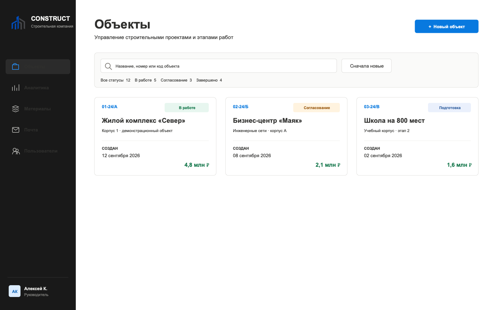
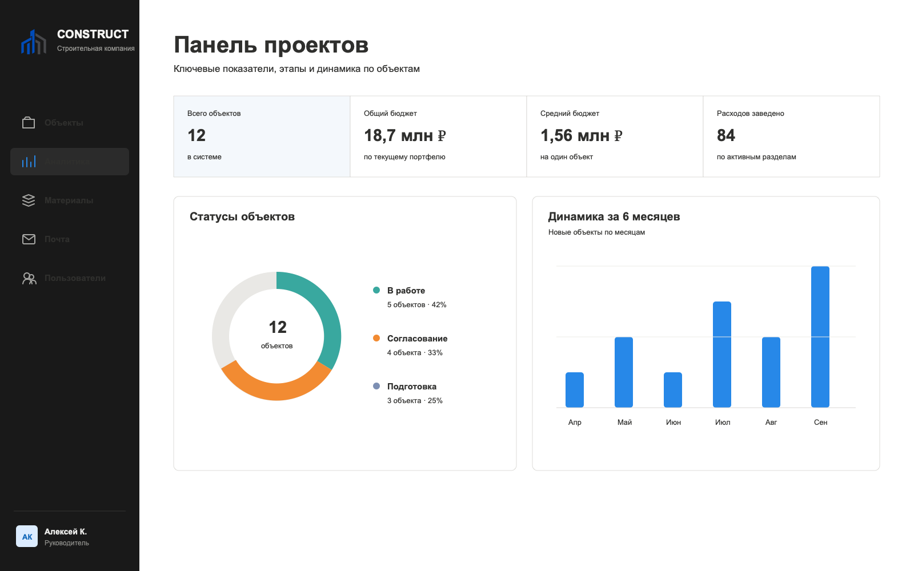
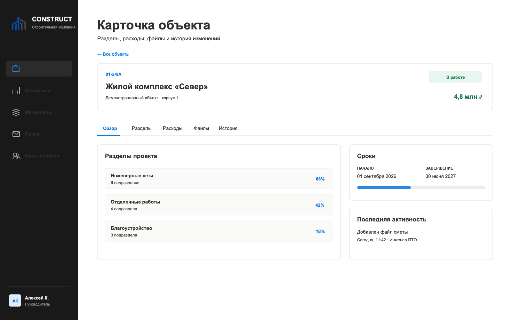
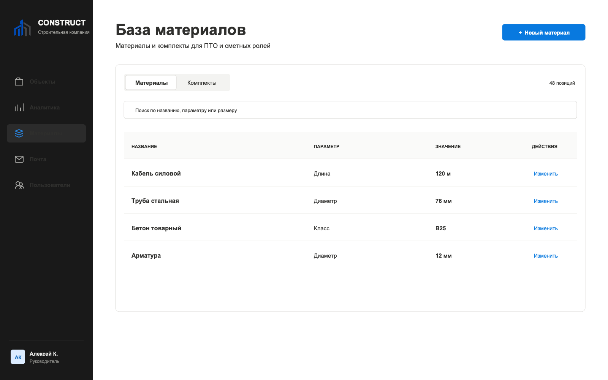
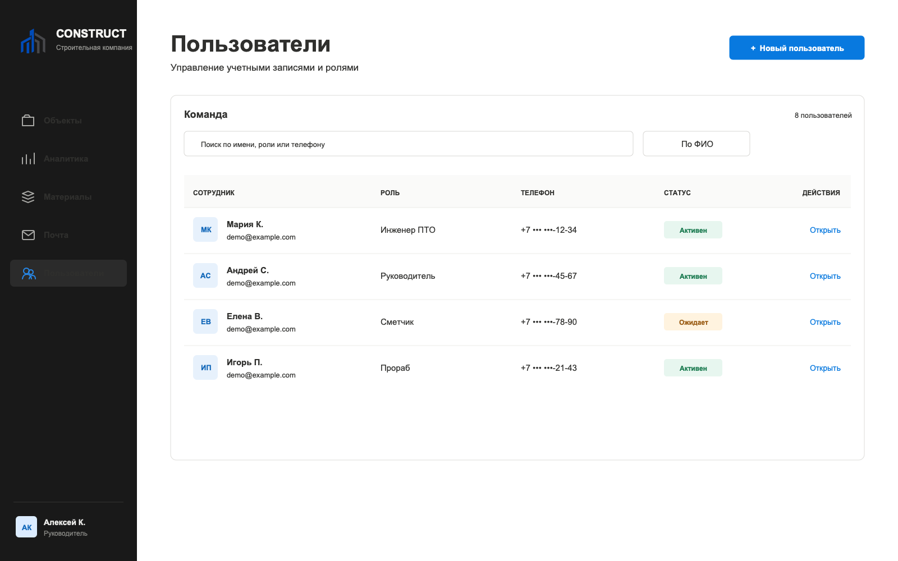

# Construction CRM — Full-stack Project Showcase

Публичный showcase CRM-системы для строительной компании. Продукт объединяет управление объектами, структурой работ, материалами, расходами, файлами, командой и аналитикой.

Public showcase of a construction company CRM. The product brings project tracking, work breakdown, materials, expenses, documents, team management, and analytics into one operational workspace.

> Все названия, пользователи, телефоны, суммы и даты на изображениях вымышлены. Репозиторий не содержит исходного кода, адресов API, конфигурации инфраструктуры или production-данных.
>
> All names, users, phone numbers, amounts, and dates shown below are fictional. This repository contains no source code, API endpoints, infrastructure configuration, or production data.

## Русский

### О продукте

CRM помогает строительной компании вести объекты от регистрации до завершения: контролировать этапы и сроки, структурировать разделы работ, учитывать материалы и расходы, хранить документы и распределять доступ между сотрудниками.

### Моя работа

#### Frontend

- перенос бизнес-сценариев из React Native в веб-приложение на React;
- адаптивный интерфейс для desktop и mobile;
- ролевая навигация и защита доступных пользователю разделов;
- страницы объектов, аналитики, материалов, пользователей, почты и профиля;
- состояния загрузки, ошибок, пустых выборок и подтверждений;
- формы, поиск, фильтрация, сортировка, статусы и работа с файлами;
- светлая и тёмная темы, унификация компонентов и дизайн-системы.

#### Backend

- REST API на Go и Gin;
- JWT-аутентификация с обновлением и завершением сессии;
- ролевая модель доступа;
- бизнес-логика объектов, разделов, подразделов и участников;
- материалы, комплекты, расходы и фотографии;
- загрузка файлов и история действий;
- импорт табличных данных и обработка документов;
- PostgreSQL, миграции и связанные сущности.

#### Интеграция и доставка

- согласование контрактов между frontend и backend;
- обработка API-ошибок и состояний загрузки;
- подготовка production-сборки веб-клиента;
- размещение статических файлов вместе с backend-приложением.

### Основные сценарии

| Направление | Возможности |
| --- | --- |
| Объекты | Создание, поиск, фильтры, сортировка, статусы и бюджет |
| Структура работ | Разделы, подразделы, участники, сроки и доступы |
| Расходы | Ручное добавление, импорт, фотографии и история изменений |
| Материалы | Общая база, единицы измерения и комплекты |
| Документы | Загрузка, группировка по типам и файлы проекта |
| Команда | Регистрация, модерация, роли, блокировка и доступы |
| Аналитика | Сводные показатели, распределение по статусам и динамика |

## English

### Product overview

The CRM supports a construction company's daily operations from project registration to completion. It tracks stages and deadlines, structures work sections, records materials and expenses, stores documents, and manages role-based team access.

### My contribution

#### Frontend

- transferred business workflows from React Native to a React web application;
- built responsive desktop and mobile layouts;
- implemented role-aware navigation and protected product areas;
- developed project, analytics, materials, users, mail, and profile screens;
- designed loading, error, empty, confirmation, and validation states;
- implemented forms, search, filters, sorting, statuses, and file workflows;
- unified components and supported light and dark themes.

#### Backend

- developed REST API functionality with Go and Gin;
- implemented JWT authentication, token refresh, and logout flows;
- supported role-based authorization;
- worked on projects, work sections, subsections, and participants;
- implemented materials, sets, expenses, and photo attachments;
- supported file uploads and audit history;
- worked with spreadsheet imports and document processing;
- used PostgreSQL, migrations, and relational entities.

#### Integration and delivery

- aligned contracts between frontend and backend;
- handled API errors and asynchronous UI states;
- prepared production web builds;
- integrated static web assets with the backend deployment.

### Core workflows

| Area | Capabilities |
| --- | --- |
| Projects | Creation, search, filters, sorting, statuses, and budget |
| Work breakdown | Sections, subsections, participants, deadlines, and access |
| Expenses | Manual entry, import, photos, and change history |
| Materials | Shared catalog, measurement units, and material sets |
| Documents | Uploads, type-based grouping, and project files |
| Team | Registration, moderation, roles, blocking, and permissions |
| Analytics | Summary metrics, status distribution, and monthly dynamics |

## Product screens

### Analytics / Аналитика

### Project workspace / Карточка объекта

### Materials / Материалы

### Users and roles / Пользователи и роли

## Architecture / Архитектура

| Layer | Technologies |
| --- | --- |
| Web | React, React Router, Zustand, Motion, Vite |
| API | Go, Gin, JWT |
| Data | PostgreSQL, pgx, SQL migrations |
| Documents | Excelize, PDF processing, file uploads |
| Delivery | Docker, production web build, static asset serving |

---

Этот репозиторий служит визуальным описанием выполненной full-stack работы и намеренно не публикует код продукта.

This repository is a visual case study of the completed full-stack work and intentionally does not publish the product source code.
