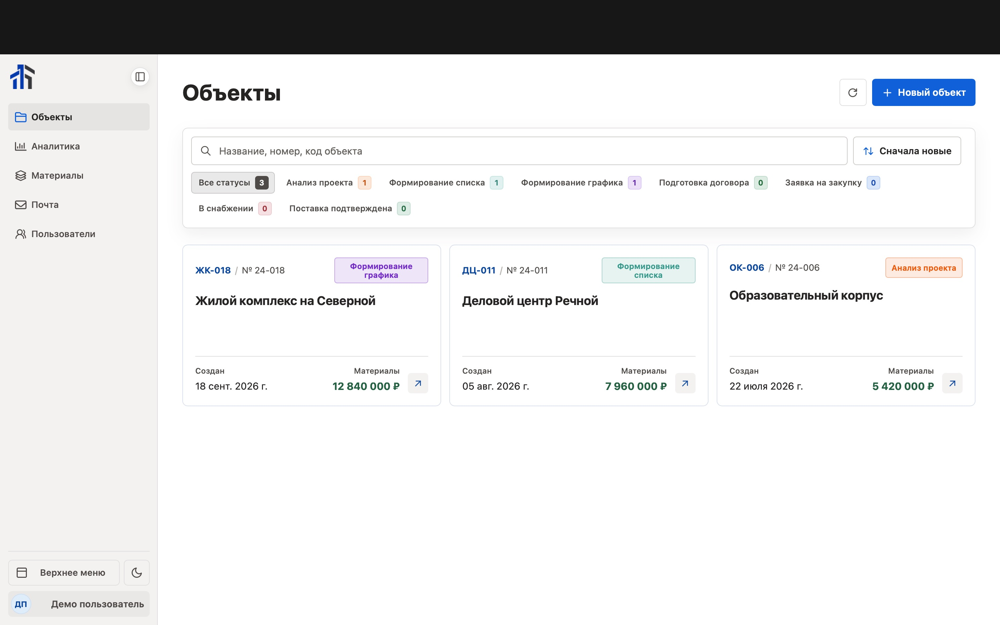
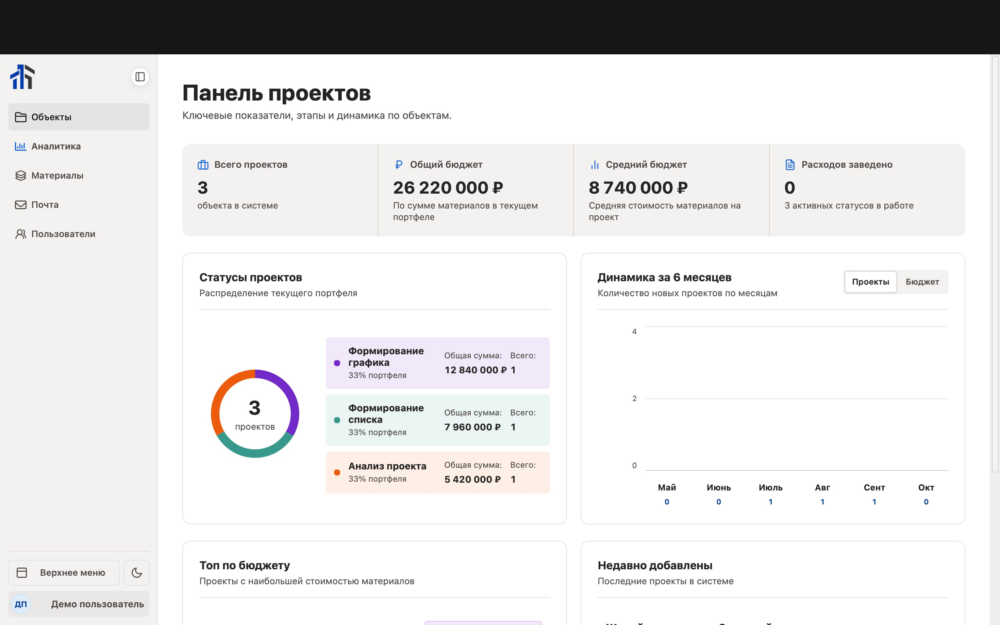
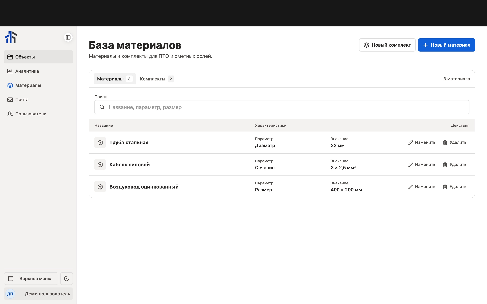
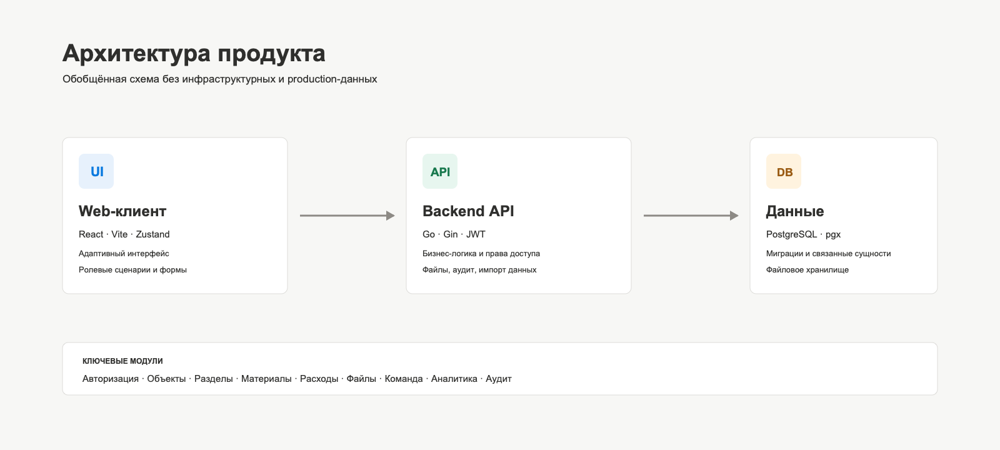

# Construction Project CRM

### Операционная система для управления строительными объектами

Full-stack CRM: объекты, этапы работ, материалы, расходы, документы, команда и аналитика в одном рабочем пространстве.

> [!NOTE]
> Это публичный визуальный кейс. Все названия, пользователи, телефоны, суммы и даты на изображениях вымышлены. Репозиторий не содержит исходного кода, адресов API, инфраструктурных конфигураций или production-данных.

## О продукте

CRM помогает строительной компании вести объекты от регистрации до завершения. В одном интерфейсе команда контролирует стадии и сроки, структуру работ, расходы, материалы, документы и доступ сотрудников.

| Контур | Что реализовано |
| :-- | :-- |
| **Объекты** | Создание, поиск, сортировка, статусы, бюджет и сроки |
| **Структура работ** | Разделы, подразделы, участники и права доступа |
| **Расходы** | Ручной ввод, импорт, фотографии и история изменений |
| **Материалы** | Общая база, единицы измерения и комплекты |
| **Документы** | Загрузка файлов и группировка по типам |
| **Команда** | Регистрация, модерация, роли и блокировка |
| **Аналитика** | Сводные показатели, статусы и динамика по месяцам |

## Моя роль

<table>
  <tr>
    <td width="33%" valign="top">
      <h3>Frontend</h3>
      
Перенос бизнес-сценариев из React Native в React, адаптивный интерфейс, ролевая навигация, формы, фильтры, состояния и темы.

    </td>
    <td width="33%" valign="top">
      <h3>Backend</h3>
      
REST API на Go и Gin, JWT-аутентификация, ролевая модель, PostgreSQL, файлы, история действий и импорт данных.

    </td>
    <td width="33%" valign="top">
      <h3>Интеграция</h3>
      
Согласование API-контрактов, обработка ошибок, production-сборка веб-клиента и доставка статических файлов.

    </td>
  </tr>
</table>

### Frontend

- перенесла основные рабочие сценарии из мобильного приложения в веб;
- разработала страницы объектов, аналитики, материалов, пользователей, почты и профиля;
- реализовала role-aware навигацию и защиту доступных пользователю разделов;
- добавила поиск, фильтры, сортировку, загрузку файлов и подтверждения действий;
- спроектировала loading, error, empty и validation states;
- унифицировала компоненты, адаптивные макеты, светлую и тёмную темы.

### Backend

- разработала REST API функциональность на Go и Gin;
- реализовала JWT-аутентификацию, обновление токена и завершение сессии;
- поддержала ролевую авторизацию для разных категорий сотрудников;
- работала с объектами, разделами, подразделами, участниками и доступами;
- реализовала материалы, комплекты, расходы, фотографии и файлы;
- добавила аудит действий, импорт таблиц и обработку документов;
- работала с PostgreSQL, миграциями и связанными сущностями.

## Интерфейс

<table>
  <tr>
    <td width="50%" valign="top">
      <strong>Объекты</strong>  
      
    </td>
    <td width="50%" valign="top">
      <strong>Аналитика</strong>  
      
    </td>
  </tr>
  <tr>
    <td colspan="2" valign="top">
      <strong>Материалы и комплекты</strong>  
      
    </td>
  </tr>
</table>

## Архитектура

| Слой | Технологии и ответственность |
| :-- | :-- |
| **Web** | React, React Router, Zustand, Motion, Vite |
| **API** | Go, Gin, JWT, ролевая авторизация |
| **Data** | PostgreSQL, pgx, SQL migrations |
| **Documents** | Excelize, PDF processing, file uploads |
| **Delivery** | Docker, production web build, static asset serving |

---

**Визуальный кейс выполненной full-stack работы. Исходный код продукта намеренно не публикуется.**

[English version](./README.en.md) · [К началу](#construction-project-crm)

